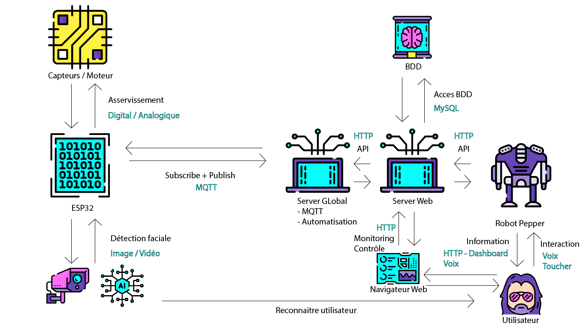
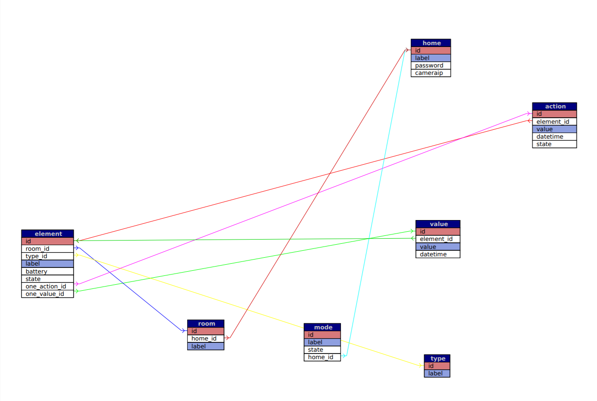

# Projet Domotique

Notre projet permet de visualiser, faciliter et administrer différents éléments de sa maison : température, humidité, porte-volet, chauffage, VMC...

# Schéma global

# Résultats attendus

Notre solution doit permettre la gestion globalisée de la maison. 
D'une part de manière autonome, en fonction des entrées garder une certaine sortie : garder une température constante. En somme, s'assurer que l'ordre donné soit réalisé.
D'autre part de façon contrôlée, c'est à dire gérer via la voix, ou de manière applicative...

## Fonctionnalités de base

- Gestion de la température de chaque pièce
- Gestion de la luminosité de chaque pièce
- Gestion des volets
- Contrôle de l'ouverture de la porte d'entrée par détection facial 
- Contrôle des prises de la maison
- Consultation en temps réel de l'état des équipements connectés
- Gestion de la maison via pepper 

## Évolutions possibles

- Mode préprogrammé (ambiance de la maison, mode chill, mode surveillance, mode absence, etc….)
	- Surveillance : détecte les mouvements dans la maison et effectue une notification
- Application Android de gestion
- DashBoard de visualisation
- Intégration Google Home 
- Ajout de code de vérification/confirmation pour l’ouverture de la porte d’entrée
- Cryptage des données / Sécurisation du serveur 
- Intégration d’un capteur luminosité pour la gestion de l’ambiance

## Matériel

- ESP32 
- Capteurs température, humidité, caméra, 
- pepper 
- servo moteur 
- led 
- serveur 

## Langage et technologie

- Python/C
- Flask 
- MQTT 
- SQL
- HTML/CSS/JS/PHP

## Activités à réaliser
- Robot Pepper :
	- Accès à l’API **Python**
	- Interagir avec utilisateur **Python**
	- Afficher information / dashboard de l’API **HTML/CSS/JS**
- Serveur WEB :
	- API / BDD **Symfony/PHP**
	- Dashboard / Contrôle pour navigateur **HTML/CSS/JS**
- Serveur Global :
	- Supervision globale **Python**
	- MQTT
- IOT **Python** :
	- Reconnaissance facial 
	- Gestion Capteurs 
		- température
		- humidité 
	- Gestion des moteurs
	- Gestion simulation Prise (LED)
	- Connexion MQTT
	
## Schéma Base de données

## Liste des éléments de base de la pièce
- VMC
- Température
- Humidité
- Volet
- Porte
- Prise
- Luminosité
